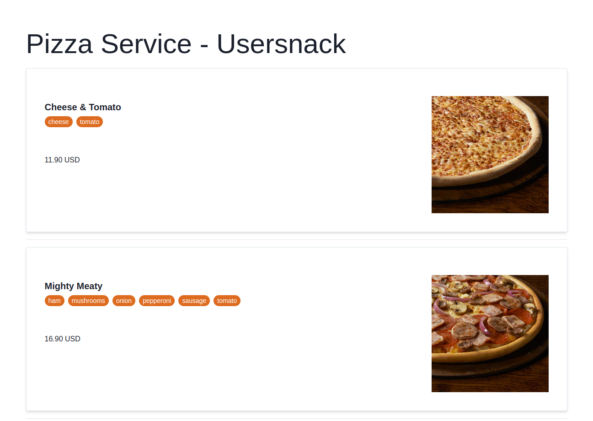
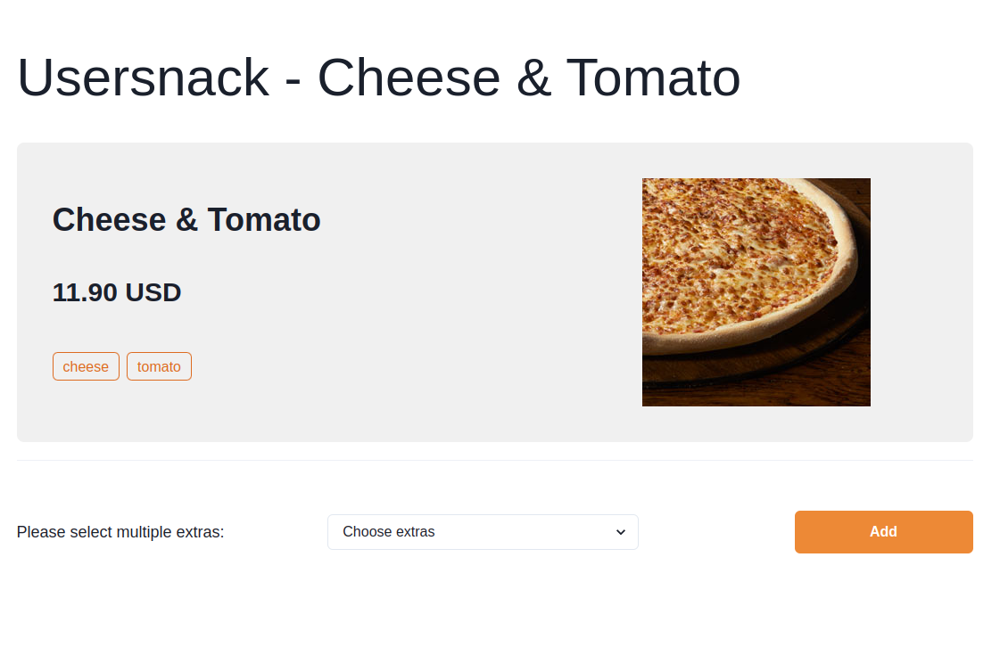
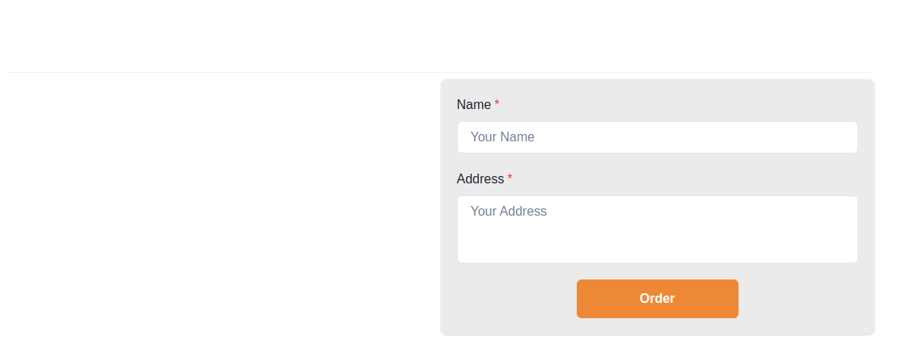
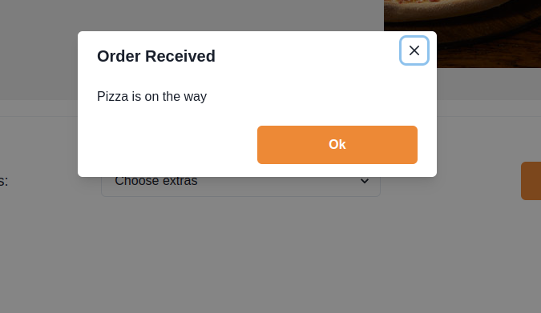

# Usersnack React Frontend

## Setup

Run to install dependencies

### `npm install`

## Note for Production

Set a REACT_APP_BACKEND_BASE_URL env variable with the backend base URL.

## Available Scripts

In the project directory, you can run:

### `npm start`

Runs the app in the development mode. Open [http://localhost:3000](http://localhost:3000) to view it in your browser.

The page will reload when you make changes. You may also see any lint errors in the console.

### `npm run build`

Builds the app for production to the `build` folder.

It correctly bundles React in production mode and optimizes the build for the best performance. The build is minified and the filenames include the hashes.

## Screenshots

### Pizzas Overview

### Pizas Detail

#### DetailSection

#### Order

#### Confirmation

